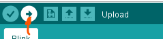

# Coding LED dojo

## Prepare IDE

1. Unzip and install drivers for UART programmer. Use `CDM212364_Setup.zip` for it.
1. Go to https://www.arduino.cc/en/software. Download and install Arduino IDE.
1. Open Preferences and add repo with ESP8266 libs.
 
`http://arduino.esp8266.com/stable/package_esp8266com_index.json`
1. Open board selection menu, find Generic ESP8266 board and set it up.

1. In examples you could find a lot of different samples, that could be applied to your project!

## How to flash board

1. Write some fab code and ensure that it can be built. 

1. If your code is brilliant, connect a board **holding the flash button** to a PC.
1. Then press Upload button.

1. In case of success you'll see progress of builf and then progress of uploading your code to the ESP8266 in console.

## How to connect LED to the board

Read super article about LED strips - https://alexgyver.ru/ws2812_guide/

Pay attention, that we will use different power block, so we'll need to use special modules to decrease voltage!